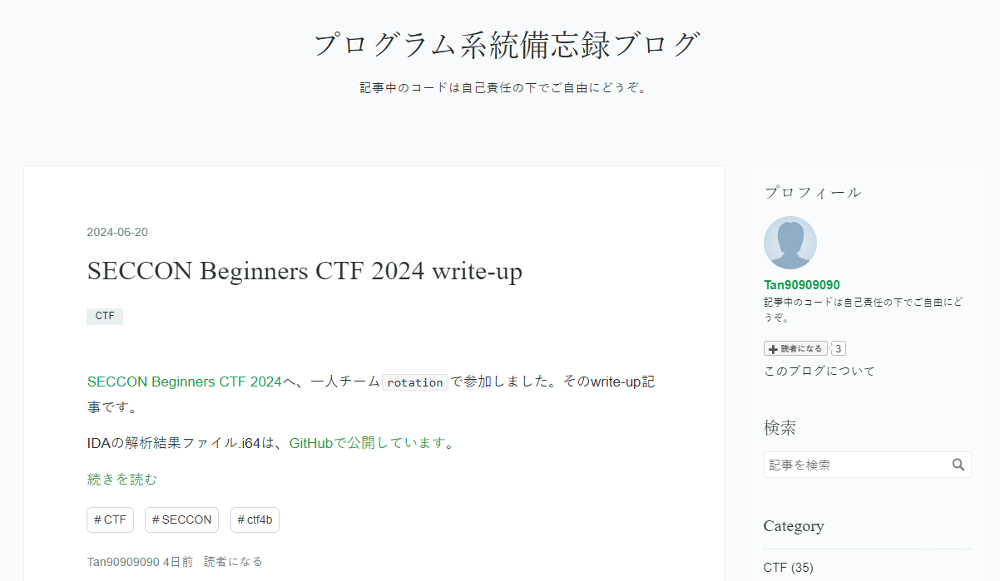
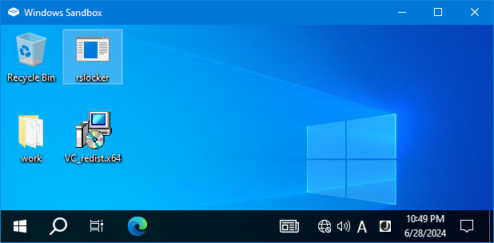
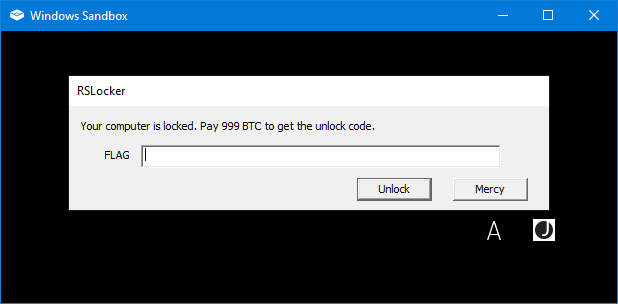

# 面白かったRev問題紹介
<style scoped>
section { font-size: 350%; }
</style>
<!-- _class: lead --> <!-- ←中央揃え invertにするならスペース区切りでいれる -->
<!-- _paginate: false -->

Tan@Tan90909090


#kurenaif_party6

<!-- styleやscriptを一番上に置くと空ページができてしまったのでスライド1枚目の後ろに足します -->
<!-- https://tech.speee.jp/entry/2019/08/01/173843 The story of Marp Next: 次世代の Marp への取り組み - Speee DEVELOPER BLOG -->
<style>
img[alt~='center'] {
  display: block;
  margin-left: auto;
  margin-right: auto;
}
</style>
<!-- https://qiita.com/yuta-katayama-23/items/d0543f4bedc739ecafcb MarpでMermaidを利用している場合のVS Codeでプレビューする方法・marp-cliで変換する方法 #VSCode - Qiita -->
<script type="module">
import mermaid from 'https://cdn.jsdelivr.net/npm/mermaid@10.0.0/dist/mermaid.esm.min.mjs';
mermaid.initialize({ startOnLoad: true });
window.addEventListener('vscode.markdown.updateContent', function() { mermaid.init() });
</script>

# 自己紹介
<!-- header: '面白かったRev問題紹介' -->
<!-- footer: '魔女のお茶会 #6(2024 夏) #kurenaif_party6' -->
<!-- paginate: true -->

 [Tan@Tan90909090](https://twitter.com/Tan90909090)

2019年にCTFを始めました
主にrevジャンルを解いています
[https://tan.hatenadiary.jp](https://tan.hatenadiary.jp) でwrite-up記事を35本書いてます

初登壇です！

---
<!-- _class: lead --> <!-- ←中央揃え invertにするならスペース区切りでいれる -->


# LT内容
- rev問題紹介
  - 面白いと思ったポイント
  - 作問者様の想定解法や私の解法 (=ネタバレあります)

- 伝えたいこと
  - あくまで「CTF問題を解くため」の紹介です
  - こんな問題がある、手法がある、ということ
  - ひたすら悩んだ問題を解けると最高！

- 「他にこんな方法がある」などあればコメント等お願いします！

# 目次
1. TSG CTF 2023 "T the weakest"
2. Ricerca CTF 2023 "RSLocker"
3. LINE CTF 2024 "BrownFlagChecker"

## TSG CTF 2023 "T the weakest"
<!-- header: '面白かったRev問題紹介' -->
- Linux x64 ELF
- CUIのフラグチェッカー問題
- コマンドライン引数としてフラグを与えるタイプ

### この問題の面白いポイント
<!-- header: '面白かったRev問題紹介 / TSG CTF 2023 "T the weakest"' -->

- 正解フラグの長さは100文字
- 「1文字チェック→正解なら別ELFを**メモリ中に**復号して実行」を
  100段階繰り返す
  →次ページで詳しく説明します
- 途中の段階から
  「1文字チェック結果にかかわらずデバッガーを検知すると失敗」などが入る
  →後で詳しく説明します
- その状況で、1文字単位の正誤判定を自動化できますか、な問題

### ELFをメモリ中に展開して実行する流れ
1. memfd_createでメモリに紐づいたファイルを作成して、fdを取得
2. writeで、取得したfdに次段階のELFを書き込み
3. sprintf(s, "/proc/self/fd/%d", fd) 形式の文字列を作成
4. execv(s, argv) で次段階のELFを実行 ← メモリ中のELFを実行！

→実行例は次ページ

### 動作の流れ
```sh
$ strace ./t_the_weakest 'TSGCTF{test}' 2>&1 | grep -e memfd_create -e execve -e write
execve("./t_the_weakest", ["./t_the_weakest", "TSGCTF{test}"], 略) = 0
memfd_create("", MFD_CLOEXEC|MFD_ALLOW_SEALING) = 3
write(3, "\177ELF\2略", 1228883) = 1228883
execve("/proc/self/fd/3", ["./t_the_weakest", "SGCTF{test}"], 略) = 0
memfd_create("", MFD_CLOEXEC|MFD_ALLOW_SEALING) = 3
write(3, "\177ELF\2略", 1216595) = 1216595
略
execve("/proc/self/fd/3", ["./t_the_weakest", "{test}"], 略) = 0
memfd_create("", MFD_CLOEXEC|MFD_ALLOW_SEALING) = 3
write(3, "\177ELF\2略", 1155155) = 1155155
execve("/proc/self/fd/3", ["./t_the_weakest", "test}"], 略) = 0
write(1, "ng\n", 3ng
```

### 途中の段階から入るデバッガー検知等の処理

最初のうちは「argvの先頭文字が正解かどうか」だけで判定します
途中から他の判定も一緒に行われるようになります

- malloc(10)結果が.bssに近いと失敗判定 (ASLR無効判定とのこと)
- getenv("LINES") か getenv("COLUMNS") の結果が
  非NULLなら失敗判定
- getppid結果にptraceでアタッチしたり
  killでSIGSTOPやSIGCONTを送信したりする中で
  想定の戻り値でなければ失敗判定
- (気付きませんでしたがsignalを使った判定もあったとのこと)

### 作問者様の想定解法
1. LD_PRELOADで、ptraceとkillを無力化する内容へ差し替える
2. strace実行してexecveの実行回数を数える
3. 先頭から1文字ずつ特定する

というのが想定解法のようです

### 私の解法
ソルバーがgdbを自動操作
- gdbでブレークポイントを仕掛けて自動実行しつつ
  1文字ずつ特定する
- 次段階ELF書き込みのwrite到達時にディスクへ保存
  - うまくいかない段階があればIDAで確認
- デバッガー対策処理は
  ブレークポイント設定→戻り値改ざんなどで突破
  →詳細は後で解説

#### (余談)pwntoolsの乱用
世間一般では、Pythonからgdbを自動操作するには
gdbの-xオプションにPythonコードを与えつつ
「import gdb」を使うようです

私はその方法を知らなかったので
pwntoolsのprocessでgdbを自動操作しました
gdbも適切なプロンプトがあるCUIプログラムなので
recvuntilやsendlineで自動化できます！

#### (余談)私の解法の図解

<div class="mermaid">
sequenceDiagram
    loop 1文字ごと
        solver->>gdb: コマンドライン引数付きで起動</br>以降gdb経由で現段階の問題ELFを制御
        activate gdb
        gdb->>現段階の問題ELF: 起動してブレークポイントを設定して実行開始
        activate 現段階の問題ELF
        gdb->>現段階の問題ELF: ブレーク位置に応じてfinやrax設定など
        gdb->>現段階の問題ELF: 正解の文字なら次段階のELFをディスクへ保存
        deactivate 現段階の問題ELF
        solver->>gdb: gdbもろとも再起動 (←今思うと冗長)
        deactivate gdb
    end
</div>

### デバッガー検知等を突破してフラグを特定
- malloc(10)結果が.bssに近いと失敗判定 (ASLR無効判定とのこと)
  →mallocへブレークポイントを仕掛けて戻り値を変更
- getenv("LINES") か getenv("COLUMNS") の結果が
  非NULLなら失敗判定
  →getenvにブレークポイントを仕掛けて戻り値をNULLへ変更
- getppid結果にptraceでアタッチしたり
  killでSIGSTOPやSIGCONTを送信したりする中で
  想定の戻り値でなければ失敗判定
  →犠牲用catプロセスを起動してgetppid結果をcatのpidへ変更

### 感想
- Linuxはメモリ中のELFを簡単に実行できる！
- LD_PRELOADが便利そうです！
- gdbも「適切なプロンプトがあるCUIツール」なので
  pwntoolsのprocessで自動化できます！

## Ricerca CTF 2023 "RSLocker"
<!-- header: '面白かったRev問題紹介' -->
- Windows x64 EXE
- GUIのTextBoxへフラグを入力してButtonイベントで正誤判定する
  フラグチェッカー問題

### この問題の面白いポイント
<!-- header: '面白かったRev問題紹介 / Ricerca CTF 2023 "RSLocker"' -->

- Screen LockerなDesktop切り替え動作
- PEB要素などを使ったデバッガー検知
- 入力内容の変換にaesenc命令を使用
  - デバッガー検知有無で値が変わる内容や
    現在のDesktop名も変換に使います

### 作問者様の想定解法 & 私の解法
- Desktop切り替え関数呼び出しなどをパッチで無力化
- デバッガー検知処理もパッチで無力化
- aesenc命令でXORされる値をデバッガー実行で確認
  →最終的な比較内容からフラグを逆算

### Desktop切り替え 1/2

RSLocker.exe起動前は、ごく普通のexplorer表示

### Desktop切り替え 2/2

RSLocker.exe起動後は、explorerすらないRSLockerだけの表示に
このような機能をScreen Lockerと呼ぶようです

どうやらUACの権限昇格確認時と同様のDesktop切り替えのようです

### aesenc命令はAES暗号化の1ラウンド分
```
AESENC xmm1, xmm2/m128
Tmp := xmm1
Round Key := xmm2/m128
Tmp := ShiftRows (Tmp)
Tmp := SubBytes (Tmp)
Tmp := MixColumns (Tmp)
xmm1 := Tmp xor Round Key
```
- 第1オペランドはブロック、本問題ではGUI入力内容
- 第2オペランドはXOR鍵、
  本問題ではデバッガー検知結果やDesktop名に由来する固定値
  - 次ページで説明

### 本問題のaesenc命令用XOR鍵の計算式は複雑
```c
// 変数名は私命名です
_XMM3 = _mm_unpacklo_epi64(
          _mm_unpacklo_epi32(
            _mm_cvtsi32_si128(_mm_crc32_u32(dwValue1, *(unsigned int *)&strDesktopNameSize16[4])),
            _mm_cvtsi32_si128(_mm_crc32_u32(dwValue1, *(unsigned int *)strDesktopNameSize16))),
          _mm_unpacklo_epi32(
            _mm_cvtsi32_si128(_mm_crc32_u32(dwValue2, *(unsigned int *)&strDesktopNameSize16[4])),
            _mm_cvtsi32_si128(_mm_crc32_u32(dwValue2, *(unsigned int *)strDesktopNameSize16))));
// 中略
    __asm { aesenc  xmm0, xmm3 }
```
aesencのXOR鍵xmm3は、デバッガー検知処理等を無視すれば固定値
ただ私はSIMD命令が何も分からず手動計算できないので
デバッガー実行してxmm3の値を確認したいです

### 本問題のデバッガー対策
- IsDebuggerPresent()
  main冒頭でこれで検知したらすぐに終了します
- NtCurrentPeb()->BeingDebugged
- NtCurrentPeb()->NtGlobalFlag
  起動後タイマー処理時にこれらで検知したらaesenc用XOR鍵が変化
  →デバッガーでXOR鍵を確認しても復号できない
  ※NtCurrentPeb()はIDAの「mov rax, gs:60h」解釈結果
- 前述した、Desktop切り替え処理

→辻褄が合うようにパッチを当てて解決

#### フラグ逆算時の工夫
- フラグ逆算にはaesencの逆演算が必要
  - aesdec命令は一見するとaesenc命令と対に見えますが
    実際は逆演算ではありません
- 逆演算の時前実装が必要ですが
  xmmレジスタ値をAESのブロックとして
  どのように割り当てるかが調べてもよく分からず
- デバッガー実行で確認した入出力の組を
  テストケースに活用しました！
- テストケースが通る割り当て方が判明して、フラグも復号成功！

### 感想
- Desktop切り替えが凄い！
  - 日常用語の「Desktop」とは全然違う意味です！
- PEB経由のデバッガー検知処理や
  aesenc命令に詳しくなれました！

## LINE CTF 2024 "BrownFlagChecker"
<!-- header: '面白かったRev問題紹介' -->
- Windows x64 EXEとWindows x64 SYS
- CUI実行中にフラグを入力する、フラグチェッカー問題

### この問題の面白いポイント
<!-- header: '面白かったRev問題紹介 / LINE CTF 2024 "BrownFlagChecker"' -->

- SYSファイルはWindowsカーネルモードドライバーです！
- EXEを起動すると、もう1つEXEを起動して
  Debugger/Debuggeeの関係になる
- 親子それぞれのプロセスがDeviceIoControlを使って、
  カーネルモードドライバーを経由して仮想アドレスをやり取り

### 親子プロセスとカーネルモードドライバーの関係
<div class="mermaid">
sequenceDiagram
    Actor CTFer
    participant 親プロセス
    participant カーネルモードドライバー
    participant 子プロセス
    CTFer->>親プロセス: 起動
    Note over 親プロセス,子プロセス: 子プロセスのデバッグ開始、カーネルモードドライバーのロード、.textセクションの改ざん検知、親プロセスのデバッガー検知
    CTFer->>親プロセス: フラグ入力
    親プロセス->>カーネルモードドライバー: 入力内容などを含むバッファのアドレスを通知
    親プロセス->>子プロセス: 実行を再開させる
    子プロセス->>カーネルモードドライバー: DeviceIoControlで通知
    カーネルモードドライバー->>子プロセス: CR3レジスタを操作しつつ、親プロセスから受けたアドレスを応答
    子プロセス->>親プロセス: 入力内容の正誤判定結果を通知
    親プロセス->>CTFer: 正誤判定結果を表示
</div>

### CR3レジスタを使った手動ページング
CR3レジスタ: ページングに関係するレジスタらしいです
1. カーネルモードドライバーは親プロセスから仮想アドレスを引数に
   CR3レジスタ内容や各種関数でなにか色々します(MmAllocateContiguousMemory, MmGetPhysicalAddress, MmGetVirtualForPhysical)
2. カーネルモードドライバーは子プロセスからの通知を受けて
   なにか色々やって、親プロセスの仮想アドレスを応答します
3. 最終的に子プロセスが親プロセスの仮想アドレスを間接参照する！

### 多数のデバッガー対策、改ざん対策
- 子プロセス側はすでにDebuggeeなので
  新たなデバッガーはアタッチ不可能
- カーネルドライバー側で
  DeviceIoControlの呼び出し順序や
  ProcessID/ThreadID等が正しいことを検証したり
  親プロセスにデバッガーがあるかを検知したり
- カーネルドライバー側で
  EXEの.text領域のCRC32を計算して改ざん検知もしたり
- 他にも色々(カーネルサイドの機能でよく分からず……)

### 作問者様の想定解法
Discordでの作問者様の書き込みを見るに、
静的解析だけですべてを追跡することが想定解法のようです

ただ私の場合、CR3レジスタの効果が全然分かっておらず
静的解析だけでは到底不可能でした
:sob::sob::sob:

### 私の解法
<center><div style="font-size: 180%">

＿人人人人人人人人＿
＞　DLL Injection　＜
＞　　　　+ 　 　　＜
＞　 IAT Hooking　 ＜
￣Y^Y^Y^Y^Y^Y^Y￣
</div>
</center>

<!--
＞ 突然の死 ＜ ジェネレーター
https://www.osstech.co.jp/cgi-bin/echo-sd
-->

### DLL Injection + IAT Hookingとは
- LinuxでのLD_PRELOADと同様の機能のはず……？
- API呼び出しを自作関数へ差し替える手法
- 呼び出された自作関数では
  API引数を調べたり
  APIの戻り値を確認したり
  その他好きな処理を挟んだり
  望むなら全く違う処理に変えたりできます
- (時間に余裕があれば)最後に解説します

### DLL Injection + IAT Hookingでは検知を回避できる？
- デバッガー検知類
  →デバッガーとしてのアタッチはしていないのでセーフ
- DeviceIoControlの呼び出し順やProcessID/ThreadIDチェック
  →EXEのAPI呼び出し順序等は変えていないのでセーフ
- EXEの.textセクションのCRC32チェック
  →書き換えるIATは.rdataセクションにある
  →.textセクションはそのままなのでセーフ！

検知を回避しつつ、自作処理を差し込める！

### DLL Injection + IAT Hookingで何をする？
- CreateProcessAを差し替えて
  子プロセスにもDLL Injection + IAT Hookingする
- DeviceIoControlを差し替えて
  子プロセスが最後に読み込む内容を確認する
- memcmpを差し替えて
  子プロセス最後の正誤判定の内容も確認する

→つまりはprintfデバッグ！

### リバーシング結果とprintfデバッグ結果で解く
- リバーシング結果から
  なにかの内容を
  鍵とIVの9組を使ってAES-128-CBCで9回暗号化してから
  memcmpで固定値と比較していると判明
- printfデバッグ結果から
  暗号化対象は入力文字列そのもの
  鍵とIVは固定値と判明
- 固定値を復号することで正解の入力を逆算できる！

### 感想
- Windowsカーネルモードドライバーを初めて読みました！
- CR3レジスタ経由のページングが
  ものすごかったです！
- DLL Injection + IAT Hookingの知識が
  役立つときが来るとは思ってませんでした！

# 付録
<!-- header: '面白かったRev問題紹介' -->
BrownFlagChecker問題などの補足事項です

1. DLL Injectionの基本的な流れ
2. IAT Hookingの原理
3. IAT Hookingの基本的な流れ

## DLL Injectionの基本的な流れ

1. CreateProcessAにCREATE_SUSPENDEDフラグを指定して
   プロセスを一時停止状態で起動します
2. VirtualAllocExで対象プロセス中にメモリを確保します
3. WriteProcessMemoryで確保した領域へDLLパスを書きます
4. LoadLibraryAのアドレスを取得します
   マシン起動中は全プロセスで同一のアドレスを取るようです
5. CreateRemoteThreadで、書き込んだDLLパスを引数に
   対象プロセスにLoadLibraryAを実行させます → DLL Injection
6. ResumeThreadでプロセス本来の動作を開始させます

## IAT Hookingの原理
PE(=EXE/DLL)がImplicit LinkingしているDLLのAPIを呼び出すときは
IAT(Import Address Table)と呼ばれる領域のアドレスを参照します
WindowsのPE LoaderがIATを解決してアドレスを書き込みます

もしIATが変更されている場合は
EXE/DLLがそのAPIを呼び出そうとした時に
変更後のアドレスが呼び出されます
→IAT Hooking

## IAT Hookingの基本的な流れ
1. HINSTANCEやHMODULEは、実はIMAGE_DOS_HEADER*です
2. 仕様書通りにIMAGE_NT_HEADERS*などを得ます
3. 仕様書通りにIMAGE_IMPORT_DESCRIPTOR*を得ます
4. IMAGE_IMPORT_DESCRIPTOR中に
   IATやILT(Import Lookup Table)のRVAがあります
5. 仕様書通りにILTを参照してAPI名を調べて
   そのAPIのIATを目的のアドレスへ変更します
   IATは通常.rdata領域にあるのでVirtualProtectも併用します

<div style="font-size: 70%">
<a href="https://learn.microsoft.com/en-us/windows/win32/debug/pe-format#the-idata-section">https://learn.microsoft.com/en-us/windows/win32/debug/pe-format#the-idata-section</a>
</div>

<!--
文献によってはILTのことをImport Name Address(INT)と呼んでいます
私も本資料を書くときに調べるまでINTだと思っていました
PE仕様書ではILTと呼んでいたので本資料でもILTと呼びます
-->

# おしまい
<!-- header: '面白かったRev問題紹介' -->

- CTFは楽しい！問題を解ければもっと楽しい！
- 今回紹介した内容が役に立てば嬉しいです！
- 素敵なコンテストを開催くださる皆様ありがとうございます！
